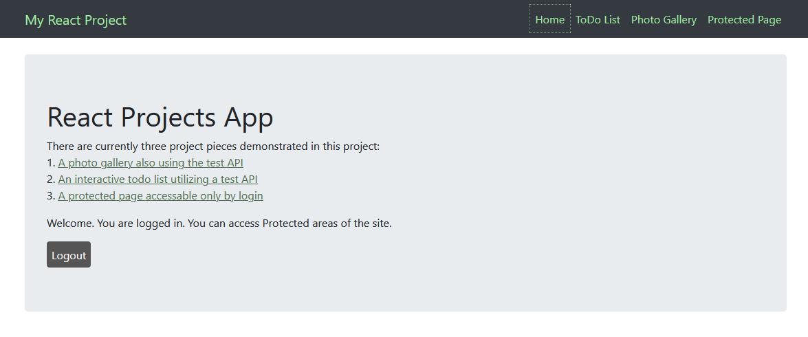

## React Project App                       
This combines 3 small projects I did when I first started learning React:   
react-app, react-gallery, and react-login   
____

 The test API used in this project is:   
 [jsonplaceholder.typicode.com](https://jsonplaceholder.typicode.com/) 

 view it here: [https://www.quantummelody.com/react_app/index.html](https://www.quantummelody.com/react_app/index.html) 

 To login to the protected area use:   
 login: user@example.com   password: Password1    

